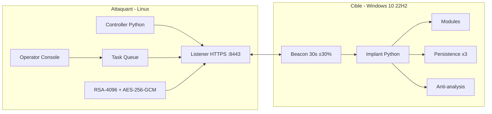
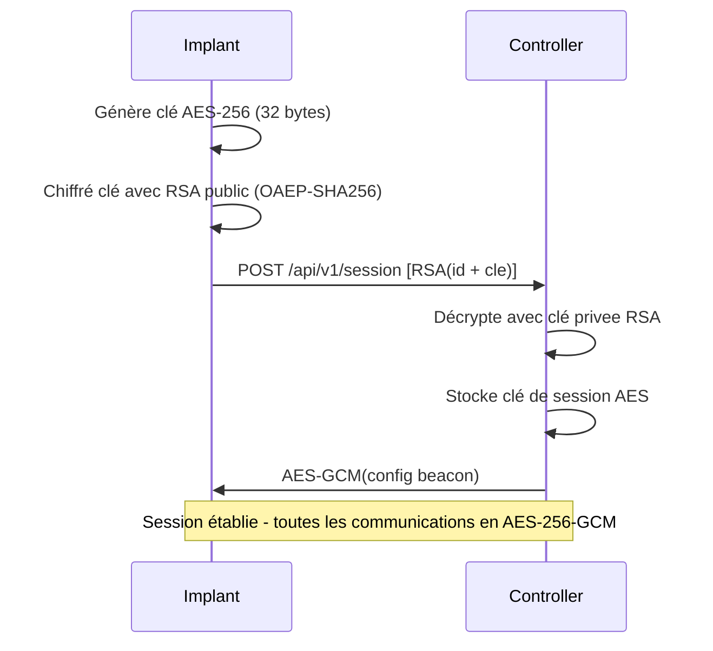
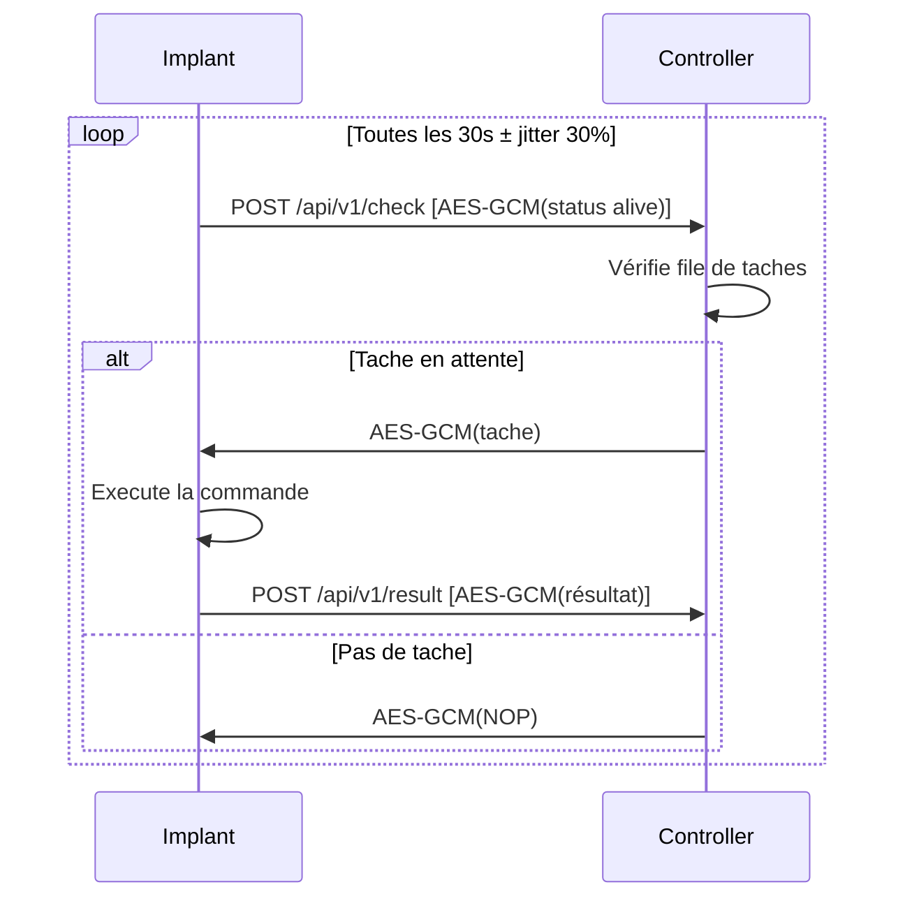
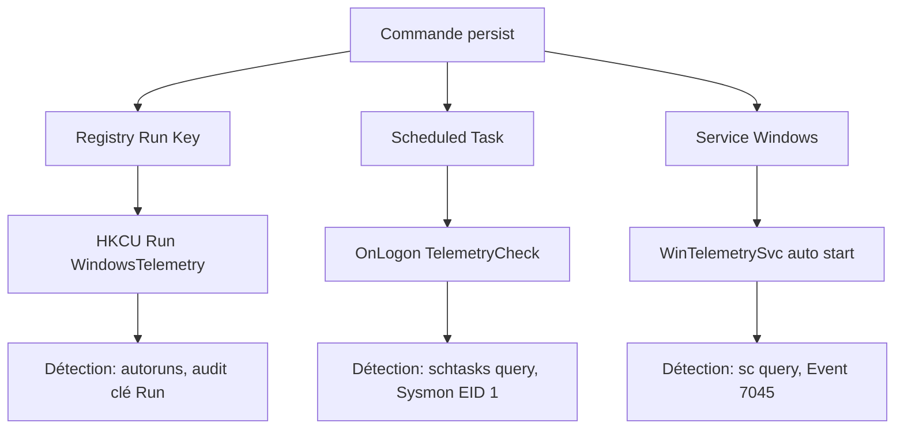
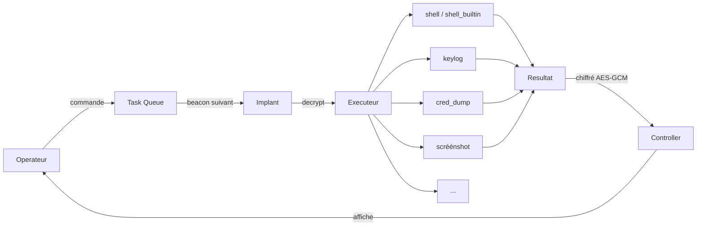

# Follow-up 1 - 25 Septembre 2026

## Architecture retenue

Pattern implant-to-controller inspiré de Sliver et Metasploit (reference architecturale uniquement).

### Protocole de communication

Handshake initial :

Beacon périodique :

Double couclé de chiffrement prouvable avec Wireshark (filtre: tls && ip.addr == <IP_CIBLE>).

### Choix techniques justifiés

| Choix | Raison | Alternative écartée |
|---|---|---|
| HTTPS (port 8443) | Protocole existant, trafic inaperçu | TCP custom (détectable par port) |
| RSA-4096 + OAEP | Echange de clé asymétrique exigé par le PDF | RSA sans padding (insécurisé) |
| AES-256-GCM | Chiffré authentifié (intégrité + confidentialite) | AES-CBC (pas authentifié) |
| Beacon 30s + jitter | Évite les patterns détectables par NIDS | Beacon fixe (signature temporelle) |
| ID = hash(hostname:user) | Identification unique par machine | UUID aléatoire (change a chaque reboot) |
| User-Agent rotation | Trafic ressemble a un navigateur normal | UA fixe (fingerprint) |

## Protocole des commandes C2

| Endpoint | Methode | Payload | Reponse |
|---|---|---|---|
| /api/v1/session | POST | RSA(id + clé session) | AES-GCM(config beacon) |
| /api/v1/check | POST | AES-GCM(status alive) | AES-GCM(tache ou NOP) |
| /api/v1/result | POST | AES-GCM(résultat commande) | AES-GCM(ACK) |

Format binaire : [16 bytes implant_id][nonce 12B][ciphertext+tag]

## Plan de persistence

| Methode | Mécanisme | MITRE ATT&CK | Détection blue team |
|---|---|---|---|
| Registry Run Key | HKCU\Run\WindowsTelemetry | T1547.001 | Audit clé Run, autoruns |
| Scheduled Task | \Microsoft\Windows\WindowsTelemetry\TelemetryCheck | T1053.005 | schtasks /query, Sysmon EID 1 |
| Service Windows | WinTelemetrySvc (auto start) | T1543.003 | sc query, Event 7045 |

## Flux d'execution d'une commande C2

## Lab environment

- Cible: Windows 10 22H2 (VM disposable, snapshot avant chaque test)
- Attaquant: Ubuntu 22.04 (WSL2)
- Outils: Wireshark (preuve chiffrement), Sysinternals (détection)
- Manifest: lab/MANIFEST.md pour reproductibilité de la demo

## Équipe

26 issues sur GitHub, 4 milestones alignes sur les follow-ups.

| Membre | Périmètre |
|---|---|
| Yohan Baechle | Architecture, controller, crypto, shell builtin |
| Lena Gonzalez Breton | Implant, persistence, anti-analysis, keylogger |
| Helene Rizzon (Pepper-Bots) | Modules étendus, tests, documentation |

## Avancement actuel

- Architecture définie et documentee
- Protocole de communication spécifie (endpoints, format binaire, handshake)
- 26 issues détaillées et assignees sur GitHub
- Repo organise avec kanban (Project KOVID)
- Choix techniques justifiés (tableau ci-dessus)
- Analyse des faiblesses identifiées (GAP_ANALYSIS.md)
- Lab environment defini avec manifest

## Objectifs avant Follow-up 2 (27/11/2026)

1. Beacon fonctionnel entre deux VM du lab
2. Handshake RSA vers AES-GCM opérationnel
3. Shell distant (version détectable acceptée dans un premier temps)
4. Registry Run key pour la persistence
5. Capture Wireshark prouvant le chiffrement
6. Au moins 3 modules étendus opérationnels

## Risques identifiés

| Risque | Impact | Mitigation |
|---|---|---|
| Python runtime détectable par l'AV | Le PDF exigé la furtivite | Documenter comme faiblesse, migration progressive |
| Pas de signature de binaire | SmartScréén bloque | Lab uniquement: pas de telechargement navigateur |
| spawn cmd.exe génère Event 4688 | Détection Sysmon | shell_builtin in-process comme alternative |
| VM cible patchee par Windows Update | Demo cassee | Snapshot VM, desactiver Update pendant la demo |
